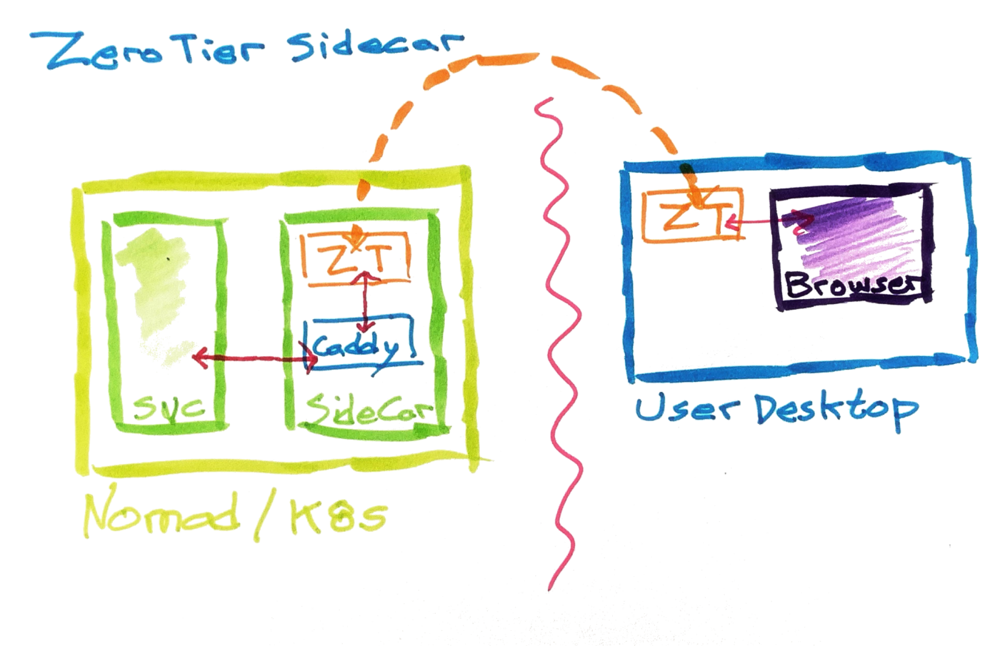

# ztsc
ZeroTier + Caddy sidecar


[](https://hub.docker.com/r/intelecy/ztsc)
[](https://hub.docker.com/r/intelecy/ztsc)

## Overview

**tl;dr:** quick'n'dirty secure/remote access to one-off apps



`ztsc` is a sidecar container that uses [ZeroTier](https://www.zerotier.com/) and [Caddy](https://caddyserver.com/) to
expose one or more services running within a container orchestration platform like Nomad or Kubernetes.

`ztsc` was built to quickly bridge the gap between "Hey, check out this cool datascience* app I built. It's running on
my laptop." and "Hey devops (team of one), can you host this somewhere for the next month?".

**Example**: A data scientist creates a [streamlit](https://www.streamlit.io/) app, and wants to share it internally with
several other employees. Devops has a Nomad cluster, but can't be bothered with setting up a new load balancer, Azure 
infrastructure, or any other dedicated networking. With `ztsc`, the app is hosted within Nomad, and is accessible
to anyone on that ZeroTier network. No need to add any cloud infrastructure, nor grant direct (VPN) user access to ports
on your Nomad cluster.

[*] Doesn't have to be datascience. But 99% of the time, it's a data scientist.

## Configuration

Configuration of the ZeroTier sidecar requires:

1) A ZeroTier network ID
2) A previously generated ZeroTier identity (see `demo/Makefile`)
3) A Caddyfile

See:

* [Getting Started with ZeroTier](https://zerotier.atlassian.net/wiki/spaces/SD/pages/8454145/Getting+Started+with+ZeroTier)
* [Caddyfile Tutorial](https://caddyserver.com/docs/caddyfile-tutorial)

## Demo

See Docker Compose and Nomad [demo](demo/README.md)

### Caddyfile

Since the full power of Caddy is available, that means that more complex features can be used.

For example:

* add automatic TLS using Let's Encrypt and DNS challenges
* add HTTP auth for "security"
* load balance between multiple service instances for horizontal scaling (remember there's still only a single `ztsc`
  instance)

### Environmental Variables

* `ZT_NETWORK_ID` (required) -- 16 byte network address of the ZeroTier network you want to join.
* `CADDYFILE_PATH` (optional, default `/etc/caddy/Caddyfile`) -- path to Caddyfile.
* `ZT_IDENTITY_PUBLIC` (optional) -- public part of ZeroTier identity.
* `ZT_IDENTITY_PUBLIC_PATH` (optional, default `/var/lib/zerotier-one/identity.public`) -- path to file containing
    public part of ZeroTier identity.
* `ZT_IDENTITY_SECRET` (optional) -- secret part of ZeroTier identity.
* `ZT_IDENTITY_SECRET_PATH` (optional, default `/var/lib/zerotier-one/identity.secret`) -- path to file containing
    secret part of ZeroTier identity.

> Note: both the public and secret parts of the ZeroTier identity must be set. Either by passing them in as a string, a
> named file, or mounted over the default location. 

### Docker Requirements

The ZeroTier sidecar requires `NET_ADMIN` and `SYS_ADMIN` capabilities as well as access to `/dev/net/tun`.

To test that you have the correct privileges:

```
$ docker run --rm -it --device /dev/net/tun --cap-add NET_ADMIN --cap-add SYS_ADMIN \
    -e ZT_NETWORK_ID=001122334455667788 \
    -e ZT_IDENTITY_PUBLIC=1234567890 \
    -e ZT_IDENTITY_SECRET=1234567890 \
    intelecy/ztsc:latest

ZeroTier identity: 1234567890
200 join OK
waiting for ZeroTier...
waiting for ZeroTier...
waiting for ZeroTier...
ZeroTier assigned addresses: 10.147.18.210/24
starting Caddy server...
```

In another shell:

```
$ curl 10.147.18.210
Hello, world! 
```

### Error Messages

`ERROR: unable to configure virtual network port: could not open TUN/TAP device: No such file or directory`

Missing `--device /dev/net/tun`

---

`ERROR: unable to configure virtual network port: unable to configure TUN/TAP device for TAP operation`

Missing `--cap-add NET_ADMIN`

---

## Integrations

### Docker Compose

```yaml
version: "3.7"
services:
  ztsc:
    image: intelecy/ztsc:latest
    environment:
      - ZT_NETWORK_ID: "001122334455667788"
    cap_add:
      - NET_ADMIN
      - SYS_ADMIN
    devices:
      - /dev/net/tun
    init: true
    volumes:
      - ./identity.public:/var/lib/zerotier-one/identity.public:ro
      - ./identity.secret:/var/lib/zerotier-one/identity.secret:ro
      - ./Caddyfile:/etc/caddy/Caddyfile:ro
  app:
    image: ...
```

### Nomad

```hcl
job "ztsc-demo" {
  type = "service"

  group "demo" {

    task "zerotier" {
      driver = "docker"

      config {
        image   = "intelecy/ztsc:latest"
        devices = [
          {
            host_path      = "/dev/net/tun",
            container_path = "/dev/net/tun",
          },
        ]
        cap_add = [
          "NET_ADMIN",
          "SYS_ADMIN",
        ]
        volumes = [
          "Caddyfile:/etc/caddy/Caddyfile:ro",
        ]
      }

      env {
        // replace with actual values
        ZT_NETWORK_ID      = "001122334455667788"
        ZT_IDENTITY_PUBLIC = "0123456789:0:xxx"
        ZT_IDENTITY_SECRET = "0123456789:0:xxx:yyy"
      }

      template {
        data = <<EOF
http://
reverse_proxy {$NOMAD_ADDR_app_http}
EOF

        destination = "Caddyfile"
      }

      lifecycle {
        sidecar = true
        hook    = "prestart"
      }
    }

    task "app" {
      /*
        fill out rest of task definition
      */
      resources {
        network {
          port "http" {}
        }
      }
    }
  }
}
```

Note, the Nomad client must allow access to the various `cap_add` capabilities:

```hcl
plugin "docker" {
  config {
    allow_caps = [ "NET_ADMIN", "SYS_ADMIN" ]
  }
}
```
