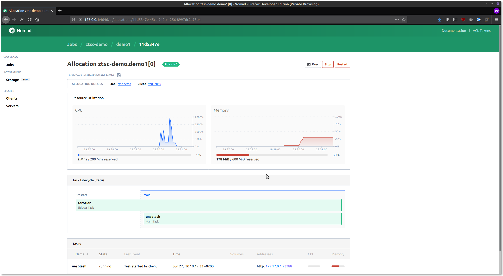

ZeroTier sidecar demo
======================

There are two different deployment options shown below: a Docker Compose deployment, and a Nomad orchestration
deployment.

Both showcase a single HTTP-based service sitting behind a Caddy proxy, accessible over ZeroTier.

The flow looks like this:

1. A user makes an HTTP request to a the ZeroTier IP address
2. The local ZeroTier VPN/daemon routes it magically across the internet to the ZeroTier container running via Docker
3. The request ends up at the Caddy server
4. Caddy reverse proxys laterally to the demo service also running via Docker
5. The demo service fetches a random image from Unsplash, converts it to SVG, adds magic 🦄 dust, and returns HTML.

Docker Compose
--------------

1. Create a `.env` file with your ZeroTier network ID
2. Generate a new identity by running `make zerotier-identity`. Note: this will create two files `identity.public` and
`identity.secret`.
3. Start the demo and sidecar containers by running `make start`.
4. Log into the [ZeroTier dashboard](https://my.zerotier.com/network) and authorize the newly created member.
5. Verify in the docker compose logs that the `ztsc_1` container has received a ZeroTier IP address.
6. Access the demo service by using the ZeroTier IP address (port 80).

```
$ cat .env 
ZT_NETWORK_ID=0000000012345678

$ make zerotier-identity 
zerotier identity: 8f01205e00

$ make start
docker-compose -p ztsc-demo up --build
Building unsplash
...
Successfully built a95bbf88b5bb
Successfully tagged ztsc-demo_unsplash:latest
Recreating ztsc-demo_unsplash_1 ... done
Recreating ztsc-demo_ztsc_1     ... done
Attaching to ztsc-demo_unsplash_1, ztsc-demo_ztsc_1
unsplash_1  | 2020/05/25 06:55:01 listening on :8080
ztsc_1      | 200 join OK
ztsc_1      | waiting for ZeroTier...
ztsc_1      | waiting for ZeroTier...
ztsc_1      | ZeroTier assigned addresses: 10.147.18.92/24
ztsc_1      | starting Caddy server...
```

Nomad
-----

> This example assumes that Nomad is already installed (see [Installing Nomad](https://www.nomadproject.io/docs/install)).

1. Run `make zerotier-identity` if you haven't already
2. Edit `demo.nomoad` and replace `ZT_NETWORK_ID`, `ZT_IDENTITY_PUBLIC`, and `ZT_IDENTITY_SECRET` with the correct
   values
3. Start up a Nomad instance `sudo nomad agent -dev -config nomad_demo_config.hcl -network-interface=eth0`. (_Note:
   change `eth0` to a real interface. Without this, the `--dev` will force things to `localhost` which doesn't work for
   this demo._)
4. Run `nomad job run demo.nomad`

       $ nomad job run demo.nomad
       ==> Monitoring evaluation "f4d48351"
           Evaluation triggered by job "ztsc-demo"
           Allocation "11d5347e" created: node "9a837850", group "demo1"
           Evaluation within deployment: "ecfd8236"
           Evaluation status changed: "pending" -> "complete"
       ==> Evaluation "f4d48351" finished with status "complete"

5. Log into the [ZeroTier dashboard](https://my.zerotier.com/network) and authorize the newly created member if you
   haven't already.
6. Open the Nomad UI by running `nomad ui` and view the job status
7. Take a look at the `zerotier` job logs (_Note: allocation ID will be different_):

       $ nomad logs 11d5347e zerotier
       nomad logs 11d5347e zerotier
       ZeroTier identity: 8f01205e00
       200 join OK
       waiting for ZeroTier...
       waiting for ZeroTier...
       waiting for ZeroTier...
       ZeroTier assigned addresses: 10.147.18.92/24
       starting Caddy server...

5. Open a browser to `http://10.147.18.92` (_Note: address will be different_)



